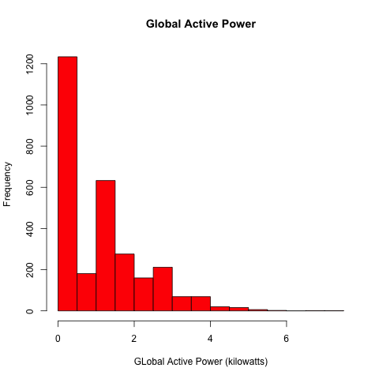
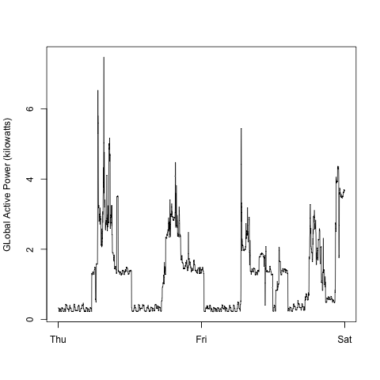
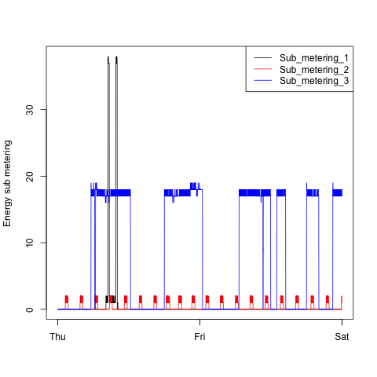
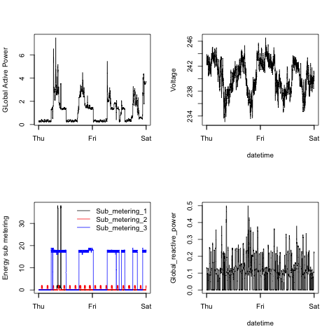

# Exploratory Data Analysis
## My Submission to Course Project 1
Hi fellow

This is my submission 

### Get the Data
This source retrieves the data.
[getData.R source](getData.R)

### Plot 1 
[plot1.R source](plot1.R)

### Plot 2
[plot2.R source](plot2.R)

### Plot 3
[plot3.R source](plot3.R)

### Plot 4
[plot4.R source](plot4.R)

